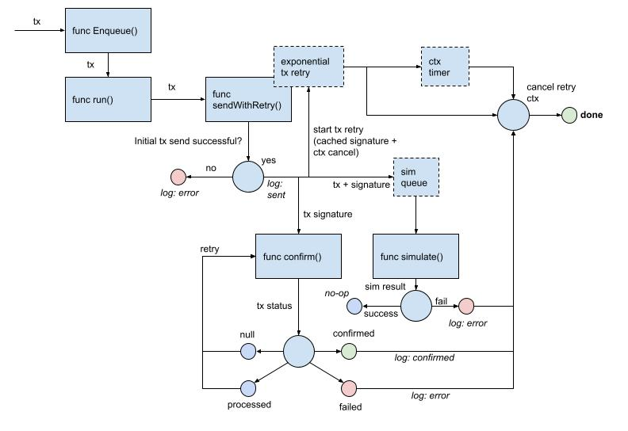

# Solana Transaction Manager Design

## Problem

Transactions sent to the chain are not guaranteed to by included. And are quite frequently dropped (2/3 - 3/4 txs are being dropped) once they have been sent to the RPC endpoint (and the endpoint has returned a transaction signature).

This causes liveness failures as well as a high number of reverts as other nodes try to transmit reports which may be superseded by later rounds.

Additional, Solana devs have confirmed that network congestion is playing a role in transactions being dropped.

## Background

Solana transactions do not require nonces, they use a recent blockhash included in the transaction as a form of transaction expiration. Additionally, Solana has a deterministic method of selecting validators to create the next slot. This is known ~2 days in advance.

When a transaction is submitted to an RPC endpoint, the node will then propagate the transaction to the next 2 validators via UDP packet. Specifically to the validator’s transaction processing unit (TPU). Additionally, the node where the tx was originally submitted will rebroadcast the packet every 2 seconds until a `maxRetries` is hit, the tx expires (based on the included blockhash), or it is processed by the validator.

A validator will handle too many transactions by forwarding it on to the next validator. However, this jump will only happen once.

Additional resource: [https://solanacookbook.com/guides/retrying-transactions.html#facts](https://solanacookbook.com/guides/retrying-transactions.html#facts)

> By default, RPC nodes will try to forward transactions to leaders every two seconds until either the transaction is finalized or the transaction’s blockhash expires (150 blocks or ~1 minute 19 seconds as of the time of this writing). If the outstanding rebroadcast queue size is greater than **[10,000 transactions](https://github.com/solana-labs/solana/blob/bfbbc53dac93b3a5c6be9b4b65f679fdb13e41d9/send-transaction-service/src/send_transaction_service.rs#L20)**, newly submitted transactions are dropped. There are command-line **[arguments](https://github.com/solana-labs/solana/blob/bfbbc53dac93b3a5c6be9b4b65f679fdb13e41d9/validator/src/main.rs#L1172)** that RPC operators can adjust to change the default behavior of this retry logic.
>

## Design + Solution

- Use `maxRetries = 0` in `sendTransaction`
    - Allows for CL node to apply custom retry strategies
- Submit tx via exponential backoff
    - Reasoning: assuming txs are discarded if duplicates, this forces the RPC node to repeatedly broadcast our tx based on our more aggressive strategy
    - Implementation:
        - Run in a goroutine per tx (`map[txSig]contextCancelFunc`, rwmutex)
        - Cancelled by the tx confirmer or by duration timeout (or higher level context)
        - Configurable rate for stable submitting rate (default to 0.25s)
- Confirm transaction via polling
    - Reasoning: can stop retrying if confirmation is received quickly, also for measuring successful transaction rates
    - Implementation:
        - Polling rate is configurable (default to 0.5s)
        - If tx is `processed` within timeout (using the OCR round time, passed in timeout)
            - continue to retry transaction until tx is `confirmed`
            - stop retrying tx by cancelling context
        - If tx is not `processed` within timeout
            - stop retrying tx (because node is rejecting the transaction as invalid or tx is dropped)
- Simulate tx to determine validity
    - Reasoning: useful for determining if tx is expected to be included onchain and returning a failure reason if applicable
    - Implementation:
        - If tx is not valid (will revert or fails for another reason), stop retrying tx, log error

