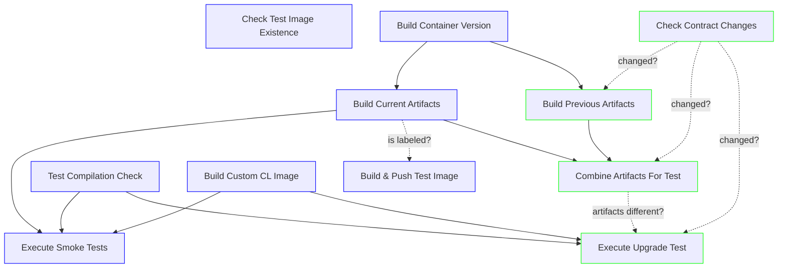

# Contents

- [How To Run E2E Tests](../docs/RunningE2eTests.md)

## Automated Program Upgrade Testing

Main Benefit: automatically test that changes made to programs are upgradeable from the deployed version

Previously, program upgrade testing is a manual process where a node cluster is spun up against deployed programs,
and then steps are manually executed. The following workflow describes automated program testing for any changes
that occur in the `chainlink-solana/contracts` folder.

This workflow adds additional steps to the base [e2e_custom_cl workflow](https://github.com/smartcontractkit/chainlink-solana/blob/develop/.github/workflows/e2e_custom_cl.yml).

- 🟦 **BLUE**: represents the base smoke test jobs
- 🟩 **GREEN**: represents the program upgrade test jobs
- the program upgrade test is only run when two conditions are true:
  - files within `./contract` are changed: this prevents running an integration test unless needed
  - generated program artifacts differ from the *pinned* version in the workflow: this prevents running an integration test unless actual program changes were made, not just trivial changes
    - note: the pinned version needs to be manually updated to track with the deployed production version

### Workflow Runs for Upgrade Testing

✅ **v1.0.2 -> v1.1.0**

- [commit](https://github.com/smartcontractkit/chainlink-solana/pull/811/commits/0699d595e373e4a3d781b3249f38dda0087421dc)
- [e2e tests job run with upgrade test](https://github.com/smartcontractkit/chainlink-solana/actions/runs/10292293982/job/28486398103?pr=811)
